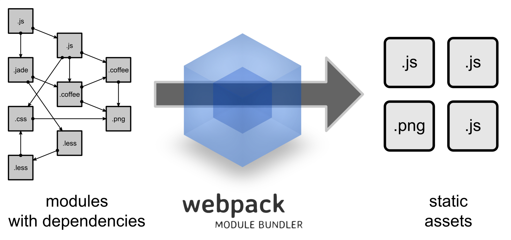

# JS / Algo

## JavaScript tooling and modules: easing development

*Pre-requisites: lesson 2*

*ECV Digital - 29/10/2015*

---
#JS ecosystem

## NodeJS modules 
[npm](https://www.npmjs.com/) <!-- .element: target="_blank" -->
- The [package.json](https://docs.npmjs.com/files/package.json) file <!-- .element: target="_blank" -->
- The `node_modules` folder
- Local and global modules
> example: npm itself

--
##### Modules in the browser ?
Introducing 
> **[webpack](https://webpack.github.io/)** <!-- .element: target="_blank" --> 



--
##### Modules in the browser ?
And a wonderfull
> [tutorial](http://webpack.github.io/docs/tutorials/getting-started/) <!-- .element: target="_blank" --> 

---
# Modules 2
What if you could bundle up even your css/html/whatever ?
> Webpack can do it 

<!-- .element: class="fragment" -->

What if you could update only some part of your application and keeping other part statefull ? <!-- .element: class="fragment" -->
> Webpack can do it, see next slide

<!-- .element: class="fragment" -->

--
# Hot reloading ([HMR](https://github.com/webpack/docs/wiki/hot-module-replacement-with-webpack)) <!-- .element: target="_blank" -->
- Auto reload when a file has been changed (nothing new)
- Keeping the application state (Ho my ***) !!!

----

No more developper testing loop
>  
- change
- ~~reload~~
- ~~do multiple actions~~
- check
- ~~redo until everything is allright~~

--
## Achieving Hot reloading
A wonderfull history article about modules:
>[From MAKE to Webpack](http://survivejs.com/webpack_react/webpack_compared)<!-- .element: target="_blank" -->

Hint:
Introducing the holy grail of the js developper command lines: 
```bash
webpack-dev-server --hot --inline
```

--
# Exercice
Create a very simple statefull application
- Change content.js to export a function which logs 
- Change entry.js to add a `setInterval` function which call the exported function
- Add some [hot module replacement code](https://webpack.github.io/docs/hot-module-replacement.html)
- Type the holy grail command
- Change your logging function and check the console to see the magic happening

> ###Statefull  environnement 

---
# Git ignore
While you were testing webpack power, you might have notice that a `node_modules` folder has appeared

When using git, you usually don't want to push depedencies because:
- They are defined in a file (package.json)
- They might take some useless extra space on GIT

Introducing the **[.gitignore](https://git-scm.com/docs/gitignore)** <!-- .element: target="_blank" -->
--
# Exercice
- Add a .gitignore file to the folder
- Edit it to avoid adding your modules
- Type `git status` to checkout that the `node_modules` is not listed anymore
- Commit and push!

---
#JS year project
Company:
>[Social Symphony](http://socialsymphonyapp.com/) <!-- .element: target="_blank" -->

Project:
> Build an audio player reading mp4 files in browsers from ie8 to the last chrome

--
# Browsers APIs
Javascript can work alone (as you experience with NodeJS) but javascript has been made asynchrone to handle I/O in a very friendly way

In the browser, you are always interacting with an API:
- [JS API](https://developer.chrome.com/extensions/api_index) <!-- .element: target="_blank" -->
- [Web API](https://developer.chrome.com/extensions/api_other) <!-- .element: target="_blank" -->


