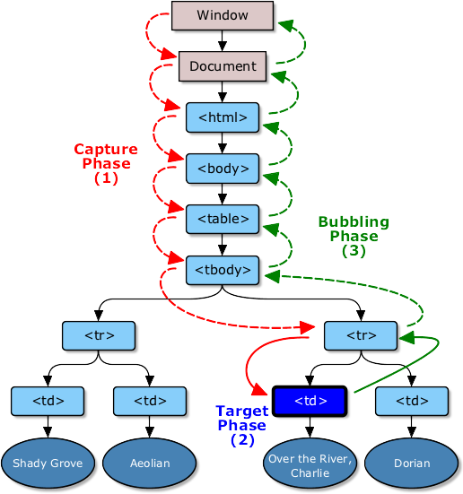

# JS / Algo
## Closure (2) and events

*Pre-requisites: lesson 5*

*ECV Digital - 26/11/2015*

---
## Multiple closure
Since a closure is based on a function, we can create multiple closure.

```javascript
function outerFunction(){ 
  function innerFunction(){} // We create a first inner function
  function innerFunction2(){} // We create a second inner function

  var holdingClosures = {
    firstClosure: innerFunction,
    secondClosure: innerFunction2
  }

  return holdingClosures;
}
var object1 = outerFunction(); // We now have 2 closures in this object
```

--
## Multiple closure
2 things:
- The outerFunction returns an object which holds our two closure
- The two innerFunctions share theirs parent scope

> Thanks to this capacity we can simulate a very simple statefull behavior

--
# Exercice
Create a simple statefull counter that you can use in the browser's console
- Create a main function
- Create a local variable to hold the count
- Create 3 closures:
  - One to increment the counter
  - One to decrement the counter
  - One to log the value
- return an object containing the 3 closures
- test it inside an html file with the console

---
## Mainstream closure error
What's wrong here :
```html
<p id="help">Helpful notes will appear here</p>
<p>E-mail: <input type="text" id="email" name="email"></p>
<p>Name: <input type="text" id="name" name="name"></p>
<p>Age: <input type="text" id="age" name="age"></p>
```
```javascript
function setupHelp() {
  var helpText = [
      {'id': 'email', 'help': 'Your e-mail address'},
      {'id': 'name', 'help': 'Your full name'},
      {'id': 'age', 'help': 'Your age (you must be over 16)'}
    ];

  for (var i = 0; i < helpText.length; i++) {
    var item = helpText[i];
    document.getElementById(item.id).onfocus = function() {
      document.getElementById('help').innerHTML = item.help;
    }
  }
};

setupHelp();
```
[Test it!](../exercices/closure-error.html) <!-- .element: target="_blank" -->
--
## Mainstream closure error

```javascript
function setupHelp() {
  var helpText = ... ;
  for (var i = 0; i < helpText.length; i++) {
    // item is declared in the setupHelp scope
    var item = helpText[i]; 
    // We create an anonymous inner function inside setupHelp
    // And we set this anonymous function as a property of a global object
    // Which means, it effectively become a closure
    document.getElementById(item.id).onfocus = function() {
      // This anon. func. will be called when the focus event is fired
      // Which means that the assignation will happen in the future
      // In that future, what is item ?
      document.getElementById('help').innerHTML = item.help;
    };
  };
};
setupHelp(); // We call setupHelp right Away
```
**Item is the last element of our array `helpText`!** <!-- .element: class="fragment" -->

--
## Mainstream closure error
We need to "save" the current state of item.

We will isolate our closure inside a scope containig the current state or the item variable
```javascript
function makeHelpCallback(copiedItem) { 
  // copiedItem is local var, it only exists in this scope
  return function() { // This is an anonymous closure
     document.getElementById('help').innerHTML = copiedItem.help; 
  };
}
```
```javascript
function setupHelp() {
  var helpText = ... ;
  for (var i = 0; i < helpText.length; i++) {
    var item = helpText[i]; 
    document.getElementById(item.id).onfocus = makeHelpCallback(item);
    // item has been passed has a parameter of the makeHelpCallback function
    // item has effectively been passed inside the makeHelpCallback function scope
  };
};
setupHelp(); // We call setupHelp right Away
```
[Test it!](../exercices/closure-error-solution.html) <!-- .element: target="_blank" -->

---
# Event Objects
event handler functions are passed an argument: the event object. 

This object gives us additional information about the event.

```javascript
addEventListener("click", function(e) { // The event object is usually named `e`
  console.log(e); // → Object e
});
```

> Copy/paste it inside the console browser to check what is inside an event

--
# Event propagation
This the event workflow:

 

--
```javascript
addEventListener("click", function(e) { // The event object is usually named `e`
  e.stopPropagation(); // We stop the propagation of the event
});

```

[Test it!](../exercices/event-propagation.html) <!-- .element: target="_blank" -->

--
# Event Default
```javascript
addEventListener("click", function(e) { // The event object is usually named `e`
  e.preventDefault();
}); 

```

[Test it!](../exercices/event-default.html) <!-- .element: target="_blank" -->

--
# Keyboard events
When a key on the keyboard is pressed, your browser fires a "keydown" event

----
## Exercice
> Create a div capturing all the keyboards input

Help yourself with [this](https://developer.mozilla.org/en-US/docs/Web/API/KeyboardEvent) <!-- .element: target="_blank" -->

--
# Mouse events
Every time the mouse pointer moves, a "mousemove" event fires.

This event can be used to track the position of the mouse.

----
## Exercice
> Display the current mouse position

Help yourself with [this](https://developer.mozilla.org/en-US/docs/Web/Events/mousemove) <!-- .element: target="_blank" -->

--
# Page events
When a page finishes loading, the "load" event fires on the window and the document body objects.

This also us to "defer" the execution of our scripts only when the whole page has loaded.

Remember that the content of script tags is run immediately when the tag is encountered.

```
var firstAttempt = document.querySelector("#after-script");
addEventListener("load", function(e) { // equivalent to window.addEventListener
  console.log("I've finished loading");
  var secondAttempt = document.querySelector("#after-script");

  console.log(firstAttempt, secondAttempt);
});
```

[Test it!](../exercices/event-load.html) <!-- .element: target="_blank" -->

---

# Project: A Todo list
> 
- Create the **"add an item"** feature
- Create the **"delete an item"** feature

--
# Project: A Todo list
Start with the `add an item` feature
- Create a local context which holds
  - An array named todos
  - A function which can add item to the array `todos`
  - A function which can return the current state of the array `todos`
  - A function which can delete an item of the array `todos`
- Link those closure to to event listeners